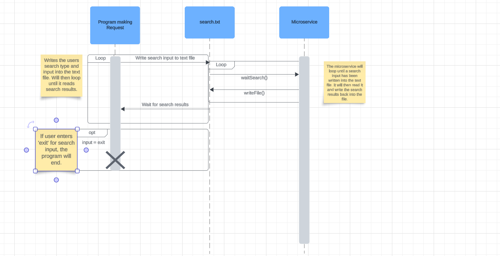

1. To request data from the microservice, write into the text file called ‘search.txt’ the word
input, to signify it is inputting data. Then add the search type and input. The format of the
text in the text file should be as follows:
input
(Search type - should be either t for title, g for genre or y for year)
(Search input - whatever the user wanted to search based on their search type)
Each of these should be on their own line, totaling 3 lines
Example:
input
t
Titanic
2. To receive data from the microservice, it will use the same text file as requesting data,
called ‘search.txt’. After the microservice has read the search input, it will then process it
and clear the text file and write the results. Instead of writing input, as for requesting
data, it will type output, to signify it is sending out data. It will follow the following format:
output
(search results in the format of Title,Genre,Rating,Year of Release)
You can then read the given results from the file. Each part of the results (title, genre,
rating, year) will be separated by a comma, allowing you to then separate each part from the
entire result. For more than one result, each result will be on its own line.
Example:
output
Titanic,Romance,7.8,1997

